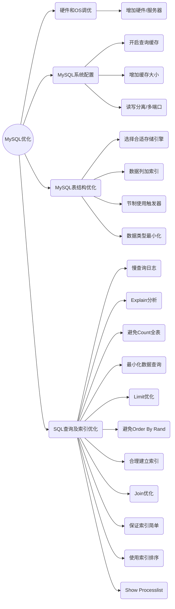

## 数据库优化的目的

#### 避免出现页面访问错误

- 由于数据库连接timeout阐述页面5xx错误
- 由于慢查询造成页面无法加载
- 由于阻塞造成数据无法提交

#### 增加数据库的稳定性

- 很多数据库问题都是由于低效的查询引起的

#### 优化用户体验

- 流畅页面的访问速度
- 良好的网站功能体验

## 可以从几个方面进行数据库优化



### 优化无非是从三个角度入手：

- 第一个是从硬件，增加硬件，增加服务器
- 第二个就是对我们的MySQL服务器进行优化，增加缓存大小，开多端口，读写分离
- 第三个就是我们的应用优化，建立索引，优化SQL查询语句，建立缓存等等

### MySQL服务器硬件和OS（操作系统）调优：

- CPU
  - OLTP 优先选择高主频的 CPU，开启性能模式，避免节能降频
  - 关闭 BIOS 中的 C-States（如遇到抖动问题时评估关闭）
- 内存
  - 保障充足的物理内存，InnoDB Buffer Pool 预算为系统内存的 60%~80%
  - 降低或禁用交换分区：vm.swappiness=1，尽量避免 MySQL 发生 swap
- 磁盘与文件系统
  - 优先 SSD/NVMe，RAID10 提升读写与可靠性
  - 文件系统建议 ext4/xfs，并使用 noatime,nodiratime 挂载选项
  - SSD 的 I/O 调度器使用 none/noop
- OS 参数（示例）
  - fs.file-max 调大；配合 ulimit -n 提升进程可打开文件数
  - net.core.somaxconn=1024，net.ipv4.ip_local_port_range=10000 65000
  - net.ipv4.tcp_tw_reuse=1，net.ipv4.tcp_fin_timeout=30
  - vm.dirty_ratio=10，vm.dirty_background_ratio=5

  示例：

  ```
  # /etc/sysctl.conf
  fs.file-max = 1000000
  net.core.somaxconn = 1024
  net.ipv4.ip_local_port_range = 10000 65000
  net.ipv4.tcp_tw_reuse = 1
  net.ipv4.tcp_fin_timeout = 30
  vm.swappiness = 1
  vm.dirty_ratio = 10
  vm.dirty_background_ratio = 5
  ```

  ```
  # /etc/security/limits.conf
  mysql soft nofile 102400
  mysql hard nofile 102400
  ```

- NUMA / 透明大页
  - 关闭透明大页（Transparent Huge Pages），减少内存抖动
  - NUMA 机器建议使用 numactl --interleave=all 启动或在操作系统层面优化分配
- 时间同步与监控
  - 保持 NTP 时间同步；iostat、vmstat、pidstat、sar 持续观测 I/O/CPU/上下文切换
  - 使用 fio/sysbench 做存储与数据库基准测试，评估容量与上限

### MySQL 系统配置：

- 版本建议与查询缓存
  - MySQL 8.0 已移除查询缓存（Query Cache），建议通过应用与 Redis/Memcached 做缓存
- InnoDB 关键参数
  - innodb_buffer_pool_size：占物理内存的 60%~80%
  - innodb_log_file_size / innodb_redo_log_capacity：根据写入量与恢复目标设置
  - innodb_flush_log_at_trx_commit：1 保证最强持久性；2/0 提升性能需评估风险
  - innodb_flush_method=O_DIRECT 减少双缓存；innodb_io_capacity/innodb_io_capacity_max 配合磁盘能力
  - innodb_buffer_pool_instances：在大 buffer 时适度分片
- 连接与线程
  - max_connections：结合业务并发与硬件设置上限，避免 OOM
  - thread_cache_size、table_open_cache、open_files_limit 与 OS ulimit 配套调优
- 临时表与排序
  - tmp_table_size 与 max_heap_table_size 一致且足量，减少临时表落盘
  - 增强 sort/join 相关内存参数但需监控以防过度占用
- 复制与高可用
  - 二进制日志（binlog）与 GTID 打开并合理设置 binlog_expire_logs_seconds
  - 使用半同步复制提升数据安全；搭建主从/组复制作为高可用基础

### MySQL 表结构优化：

- 选择合适的存储引擎
- 在数据列上加上索引(不要过度使用索引，评估你的查询)
- 有节制的使用触发器
- 根据最左前缀原则设计联合索引，尽量让常用查询成为覆盖索引
- 控制行宽与列类型（如合理使用 VARCHAR / TEXT），避免超长行导致页分裂与缓冲命中下降
- 谨慎使用分区表（Partition），明确分区键与查询模式
- 归档历史数据，冷热分层，降低核心表体量

### SQL查询及索引优化：

- 使用慢查询日志slow-log，找出执行慢的查询
- 使用 EXPLAIN 来决定查询功能是否合适
- 避免在整个表上使用count(\*) ，它可能会将整个表锁住，最好 count一个字段，比如count（id），或者count(1)
- 最小化你要查询的数据，只获取你需要的数据，通常来说不要使用 \*
- 当只要一行数据时使用LIMIT1
- 避免使用 ORDER BY RAND()
- 这些操作都是比较耗资源的DISTINCT、COUNT、GROUP BY、各种MySQL函数。
- 合理的建立索引，为搜索字段建索引，在 WHERE、GROUP BY 和 ORDER BY 的列上加上索引
- 在Join表的时候使用相当类型的例，并将其索引
- 保证索引简单，不要在同一列上加多个索引
- 使用索引字段和 ORDER BY 来代替 MAX
- 当服务器的负载增加时，使用SHOW PROCESSLIST来查看慢的/有问题的查询。
